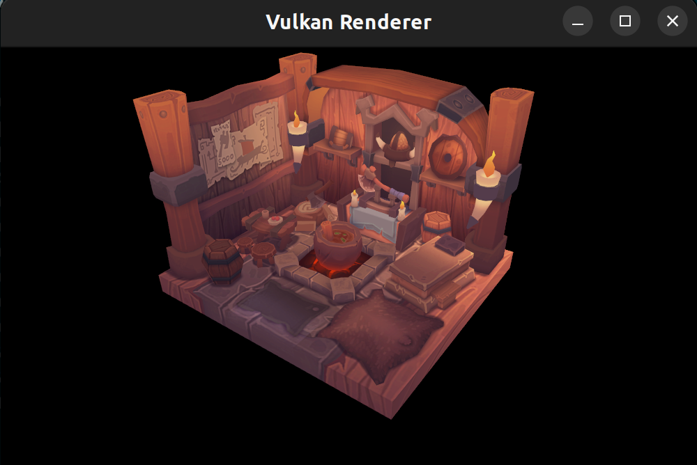

# Vulkan Renderer

C++ implementation following https://vulkan-tutorial.com/

## Dependencies

- [GLFW](https://www.glfw.org/) for window creation
- [stb_image.h](https://github.com/nothings/stb) for loading images
- [tiny_obj_loader.h](https://github.com/tinyobjloader/tinyobjloader) for loading .obj files
